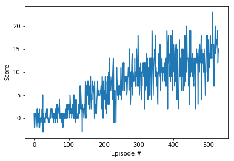

# Report

## Model

Q-learning is the chosen approach, using a neural network to approximate the function due to the high dimensionality of the input.

The approximator is a fully connected network with the following architecture:

37 --(ReLU)-> 64 --(ReLU)-> 64 --(Linear)-> 4

Where 37 are the input values, two hidden layers of 64 neurons and a final layer composed of 4 neurons (available actions).

Last layer has a linear activation, allowing negative values (something avoided in the output of the previous layers). Very high and low values are allowed because ReLU and Linear activation functions are not bouned.

*See model.py*.

## Agent

The reinforcement learning agent implements a couple of tricks added to a vanilla DQN Agent.

The first trick is to use two networks to stabilize the learning stage. A.k.a. *target* network, which will be used to compute target Q-values during updates. Updating this network after some episodes. Local network is updated every time.

Another trick is to use Experience Replay (a buffer of tuples `<state, action, reward, next state, done>`) that are collected while training. But are presented to the network in a different order to avoid bad convergence due to correlation between consecutive states.

*See dqn_agent.py*

## Hyperparameters

About experience replay, the buffer has a limit of 100000 tuples.
Consumed in minibatches of 64.

The discount factor is .99, so we care a lot about future rewards.

The soft update of target parameters is 1e-3. Updated every 4 steps.

Learning rate is 5e-4, small in order to avoid divergence, but big enough to get the goal in 458 episodes.

## Goal

The goal of being above 13 (in this case 13.1) in average is achieved in 458 episodes with the following noisy but nice ascending trend:

 

## Future work

Additional techniques could be implemented such as Dueling DQN or Prioritized Experience Replay as an improvement to the already implemented trick.

By the way, some parameter tuning could be performed in order to accelerate convergence and get a smother (and stable) learning.

## Notes

The learned weights are attached in the file: checkpoint_p1.pt

An HTML version of the Navigation notebook has been attached to make it easy for visualizing the project (code and results because the export was done after training) if there were any problem with the environment creation.

Thank you!